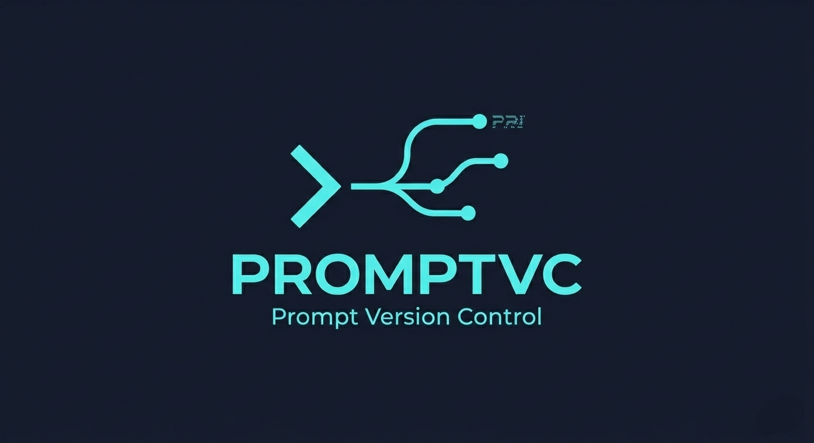

<p align="center">
  
</p>

<h1 align="center">PromptIQ</h1>

<p align="center">
  <strong>The intelligent prompt engineering toolkit.</strong><br>
  Version control + 4-stage evaluation + A/B testing + auto-improvement — all from your terminal.
</p>

<p align="center">
  <a href="https://pypi.org/project/promptiq/"></a>
  <a href="https://python.org"></a>
  <a href="./LICENSE"></a>
</p>

<p align="center">
  <a href="#-the-problem">Problem</a> ·
  <a href="#-install">Install</a> ·
  <a href="#-quick-start">Quick Start</a> ·
  <a href="#-the-4-stage-judge">Judge</a> ·
  <a href="#-ab-testing">A/B Test</a> ·
  <a href="#-auto-improve">Auto-Improve</a> ·
  <a href="#-commands">Commands</a>
</p>

---

## 💀 The Problem

Every other prompt tool either:

- **Just stores versions** — like git, but for text. No intelligence. No scoring. No improvement.
- **Requires a cloud account** — your prompts on someone else's server, $200/month.
- **Locks you into a framework** — LangChain-only, or tied to a specific LLM provider.

**PromptIQ is different.** It runs entirely on your machine, costs nothing beyond your API calls, works with any LLM, and doesn't just store your prompts — it *understands* them.

---

## ✦ What PromptIQ Does

```
promptiq commit chatbot system.txt -m "improved tone" --judge --test-cases inputs.json
```

That single command:

1. **Saves the version** with semver (`v1.2.0`) and a hash
2. **Scores the prompt text** across 5 quality dimensions
3. **Runs the prompt on real inputs** and evaluates the actual LLM outputs
4. **Compares to the previous version** and declares a winner
5. **Generates an improved version** targeting your specific weaknesses
6. **Stores everything** locally in plain JSON — no cloud, no account

---

## ✦ Why PromptIQ vs Everything Else

| | PromptIQ | Braintrust | LangSmith | PromptLayer | git |
|---|---|---|---|---|---|
| Local-first, no cloud | ✅ | ❌ | ❌ | ❌ | ✅ |
| Runs prompt + judges output | ✅ | ✅ | ✅ | ❌ | ❌ |
| Auto-improve suggestions | ✅ | ❌ | ❌ | ❌ | ❌ |
| A/B test from CLI | ✅ | ✅ | ❌ | ✅ | ❌ |
| Works without framework lock-in | ✅ | ✅ | ❌ | ✅ | ✅ |
| Free (beyond API costs) | ✅ | ❌ | ❌ | ❌ | ✅ |
| Semver + branches | ✅ | ❌ | ❌ | ❌ | ✅ |

---

## ⚡ Install

```bash
# With Claude (recommended)
pip install "promptiq[anthropic]"
export ANTHROPIC_API_KEY=sk-ant-...

# With OpenAI
pip install "promptiq[openai]"
export OPENAI_API_KEY=sk-...

# Both
pip install "promptiq[all]"
```

---

## 🚀 Quick Start

```bash
# Commit a version
promptiq commit chatbot system.txt -m "initial draft"

# Commit + full 4-stage evaluation
promptiq commit chatbot system.txt -m "improved" --judge

# Commit + evaluate with real test cases
promptiq commit chatbot system.txt -m "v2" --judge --test-cases inputs.json

# See history with quality scores
promptiq log chatbot

# Word-level diff between versions
promptiq diff chatbot 1.0.0 1.1.0

# A/B test two versions
promptiq ab chatbot 1.0.0 1.1.0 --test-cases inputs.json

# Get AI-improved version
promptiq improve chatbot

# Export Markdown changelog
promptiq export chatbot
```

---

## 🧠 The 4-Stage Judge

The judge is what separates PromptIQ from every other local tool. It doesn't just score your prompt — it tests real behavior.

```
Stage 1 ── Static Analysis    score the prompt text itself
Stage 2 ── Output Evaluation  run on LLM, judge real outputs
Stage 3 ── Version Compare    head-to-head vs previous version
Stage 4 ── Auto-Improvement   rewrite targeting your weaknesses
```

### Stage 1 — Static Analysis

Scores the prompt on 5 dimensions (each 0–10):

| Dimension | What it measures |
|---|---|
| Clarity | Is it unambiguous? Would two engineers interpret it identically? |
| Specificity | Are instructions concrete, not vague? |
| Conciseness | Free of filler and redundancy? |
| Instruction Quality | How precisely does it guide model behavior? |
| Robustness | Does it handle edge cases and failure modes? |

### Stage 2 — Output Evaluation

Sends your prompt + each test input to a real LLM, captures the output, then judges it:

```
  Test 1: "Explain quantum computing to a 10-year-old"
    Relevance:     ████████░░ 8/10
    Instructions:  ██████████ 10/10
    Quality:       ███████░░░ 7/10
    Verdict: Output was clear but slightly too technical for the audience.
```

### Stage 3 — Version Compare

```
  Old version:  6.2/10
  New version:  8.4/10
  Delta:        ▲ 2.2 pts

  New version wins ✓
  The new version adds concrete output format requirements that were
  missing before, eliminating the model's tendency to ramble.

  Improvements:
  ✅ Added explicit JSON format requirement
  ✅ Defined maximum response length

  Regressions:
  ❌ Persona definition became slightly vague
```

### Stage 4 — Auto-Improvement

```
  Changes:
  → Replaced "be helpful" with "answer in under 3 sentences" (specificity)
  → Added "If you don't know, say 'I don't know'" (robustness)
  → Removed redundant "as an AI language model" phrase (conciseness)

  Expected gain: +2 pts specificity, +1.5 pts robustness

  💡 Improved version saved → suggested.txt
```

---

## 🔬 A/B Testing

Run two versions against the same inputs. Every case gets an independent judge.

```bash
# Create inputs file (JSON array or plain text, one per line)
cat > inputs.json << 'END'
["Summarize this in 2 sentences: ...", "What are the risks of ...", "Help me write ..."]
END

# Run A/B test
promptiq ab chatbot 1.0.0 1.2.0 --test-cases inputs.json
```

```
  A/B Test: v1.0.0 (a3f92c1b)  vs  v1.2.0 (7e1b4c2a)
  3 test cases...

  Case 1  Summarize this in 2 sentences...
  v1.0.0: 6.3/10  v1.2.0: 8.1/10  → v1.2.0
  New version was more concise and better followed the 2-sentence constraint.

  Case 2  What are the risks of...
  v1.0.0: 7.0/10  v1.2.0: 6.8/10  → v1.0.0
  Old version gave a more structured risk breakdown.

  ─────────────────────────────────────────────
  v1.0.0 wins:    1
  v1.2.0 wins:    2

  Avg v1.0.0: 6.8/10
  Avg v1.2.0: 7.6/10
  Delta:    ▲ 0.8 pts

  WINNER: v1.2.0
```

---

## 💡 Auto-Improve

Get an AI-rewritten version of any commit, targeting its specific weaknesses:

```bash
promptiq improve chatbot           # improve latest
promptiq improve chatbot 1.0.0    # improve specific version
```

Review `suggested.txt`, then commit it:

```bash
promptiq commit chatbot suggested.txt -m "apply AI improvements" --judge
```

---

## 📖 Commands

```bash
# Versioning
promptiq commit <n> <file> -m "msg" [--judge] [--test-cases f.json] [--bump minor]
promptiq log <n> [-n 10] [--show-content]
promptiq diff <n> <ref_a> <ref_b>        # REF = hash prefix or semver
promptiq status <n>
promptiq checkout <n> <ref> [--output f.txt]
promptiq ls
promptiq delete <n>

# Intelligence
promptiq judge <file> [--test-cases f.json] [--compare-with <n>]
promptiq improve <n> [<ref>] [--output improved.txt]
promptiq ab <n> <ref_a> <ref_b> --test-cases f.json

# Branches
promptiq branch create <n> <branch>
promptiq branch switch <n> <branch>
promptiq branch ls <n>

# Export
promptiq export <n> [--format markdown|json|scores]
```

---

## 🗄️ Storage

```
~/.promptiq/
└── prompts/
    ├── chatbot.json
    └── summarizer.json
```

Plain JSON. Human-readable. Git-friendly. No database. No lock-in. Every file is a complete history you can read, copy, and share.

---

## 🔬 Architecture

```
promptiq/
├── cli.py         ← all commands — pure I/O, zero business logic
├── store.py       ← JSON storage with semver + branches
├── differ.py      ← word-level + line-level diff
├── display.py     ← terminal rendering
├── ab.py          ← A/B testing engine
├── export.py      ← Markdown, JSON, score report
└── judge/
    ├── __init__.py  ← orchestrator — runs all 4 stages
    ├── client.py    ← provider detection + unified LLM call
    ├── static.py    ← Stage 1: static analysis
    ├── runner.py    ← Stage 2: run prompt + judge output
    ├── compare.py   ← Stage 3: head-to-head comparison
    └── suggest.py   ← Stage 4: auto-improvement
```

One rule: **each layer knows nothing about the others.**

---

## 📄 License

MIT — use it, fork it, build on it, ship it.

---

<p align="center">
  <em>Prompt engineering shouldn't be guesswork.<br>
  Every change should be measurable. Every version should be improvable.<br>
  That's what PromptIQ is for.</em>
</p>

<p align="center">If PromptIQ made your prompts better — leave a ⭐</p>
